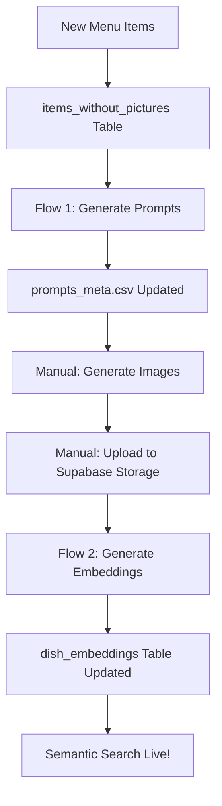

# Semantic Search Automation - Implementation Summary

## 📦 What Was Created

A complete automation GUI for managing semantic search workflows in the Dishplay application.

### Core Components

1. **[semantic_search_automation_gui.py](scripts/semantic_search_automation_gui.py)**
   - Tkinter-based GUI application
   - Two automated workflows
   - Real-time progress logging
   - Error handling and user feedback

2. **Database Migration Update**
   - Updated [semantic_search_setup.sql](supabase/migrations/semantic_search_setup.sql)
   - Added `processed` column to `items_without_pictures` table
   - Enables tracking of which items have been processed

3. **Documentation**
   - [QUICKSTART_AUTOMATION.md](scripts/QUICKSTART_AUTOMATION.md) - 5-minute setup guide
   - [AUTOMATION_GUI_README.md](scripts/AUTOMATION_GUI_README.md) - Complete documentation
   - [run_automation_gui.bat](scripts/run_automation_gui.bat) - Windows launcher
   - [run_automation_gui.sh](scripts/run_automation_gui.sh) - Linux/Mac launcher

---

## 🎯 Features

### Flow 1: Generate Prompts for Unmatched Items

**Purpose:** Automatically create image prompts for menu items that weren't matched semantically.

**Steps:**
1. Fetches unmatched items from `items_without_pictures` table (where `processed = false`)
2. Creates `input.csv` with item details
3. Runs Ollama script to generate prompts using LLM
4. Updates `prompts_meta.csv` with new entries (deduplicates by `name_opt`)
5. Marks items as `processed = true` in Supabase

**Output:**
- Updated `CSV-to-structured-text/prompts_meta.csv`
- Generated prompt files: `prompts_0001.txt`, etc.

**User Action Required After:**
- Generate images using the prompts
- Upload images to Supabase storage bucket `dishes-photos`

---

### Flow 2: Generate & Upload Embeddings

**Purpose:** Create vector embeddings for semantic search and upload to Supabase.

**Steps:**
1. Clears all old embeddings from `dish_embeddings` table
2. Generates embeddings from `prompts_meta.csv` using BAAI/bge-m3 model
3. Uploads embeddings to Supabase in batches of 100

**Output:**
- `Clean-dish-list/embeddings/recipes.bge-m3.parquet`
- `Clean-dish-list/embeddings/recipes.bge-m3.npy`
- Populated `dish_embeddings` table in Supabase

---

## 🏗️ Architecture

### Directory Structure
```
Programming/
├── dishplay-backend/
│   ├── scripts/
│   │   ├── semantic_search_automation_gui.py  ← Main GUI
│   │   ├── upload_embeddings_from_prompts_meta.py
│   │   ├── run_automation_gui.bat
│   │   ├── run_automation_gui.sh
│   │   ├── AUTOMATION_GUI_README.md
│   │   └── QUICKSTART_AUTOMATION.md
│   ├── supabase/migrations/
│   │   └── semantic_search_setup.sql  ← Updated with 'processed' column
│   ├── app/core/
│   │   └── supabase_client.py  ← Used by GUI
│   └── .env  ← Supabase credentials
├── CSV-to-structured-text/
│   ├── csv_to_prompts_ollama.py  ← Ollama prompt generation
│   ├── prompts_meta.csv  ← Main prompts database
│   └── input.csv  ← Temporary input for Flow 1
└── Clean-dish-list/
    ├── embed_prompts_meta.py  ← Embedding generation
    └── embeddings/  ← Output directory
```

### Database Schema

**items_without_pictures** (updated)
```sql
CREATE TABLE items_without_pictures (
    id BIGSERIAL PRIMARY KEY,
    created_at TIMESTAMP WITH TIME ZONE DEFAULT NOW(),
    title TEXT NOT NULL,
    description TEXT,
    processed BOOLEAN DEFAULT FALSE  ← NEW COLUMN
);
```

**dish_embeddings** (existing)
```sql
CREATE TABLE dish_embeddings (
    id BIGSERIAL PRIMARY KEY,
    name_opt TEXT NOT NULL UNIQUE,
    title TEXT NOT NULL,
    description TEXT,
    type TEXT,
    embedding vector(1024),
    created_at TIMESTAMP WITH TIME ZONE DEFAULT NOW(),
    updated_at TIMESTAMP WITH TIME ZONE DEFAULT NOW()
);
```

---

## 🔄 Complete Workflow



### Step-by-Step

1. **New menu items** are added to restaurant database
2. **Semantic search fails** to find matches (similarity < 0.8)
3. **Backend logs** items to `items_without_pictures` table
4. **User runs Flow 1**:
   - GUI fetches unmatched items
   - Ollama generates prompts
   - `prompts_meta.csv` updated
   - Items marked as `processed = true`
5. **User generates images** (manual step with Stable Diffusion/DALL-E)
6. **User uploads images** to Supabase storage
7. **User runs Flow 2**:
   - Old embeddings cleared
   - New embeddings generated
   - Uploaded to Supabase
8. **Semantic search** now includes new items! ✅

---

## 🚀 Getting Started

### Prerequisites

1. **Python 3.8+** with dependencies:
   ```bash
   pip install -r dishplay-backend/requirements.txt
   ```

2. **Ollama** (for Flow 1):
   ```bash
   # Install from https://ollama.ai
   ollama pull qwen3:8b
   ollama serve
   ```

3. **Supabase credentials** in `.env`:
   ```bash
   SUPABASE_URL=https://your-project.supabase.co
   SUPABASE_SERVICE_ROLE_KEY=your_service_role_key
   ```

4. **Database migration** applied:
   ```sql
   -- Run in Supabase SQL Editor
   -- File: supabase/migrations/semantic_search_setup.sql
   ```

### Launch GUI

**Windows:**
```bash
dishplay-backend\scripts\run_automation_gui.bat
```

**Linux/Mac:**
```bash
dishplay-backend/scripts/run_automation_gui.sh
```

**Or directly:**
```bash
cd dishplay-backend/scripts
python semantic_search_automation_gui.py
```

---

## 📊 Performance

### Flow 1 (Ollama Prompt Generation)
- **Speed:** ~2-5 seconds per item
- **100 items:** ~5-10 minutes
- **Depends on:** Ollama model, CPU/GPU

### Flow 2 (Embedding Generation)
- **With GPU (RTX 4090):** ~10-20 seconds for 50k items
- **With CPU:** ~5-10 minutes for 50k items
- **Upload:** ~1-2 minutes for 50k items (batched)

---

## 🛠️ Technical Details

### Dependencies

**Core:**
- `tkinter` (built-in Python GUI)
- `supabase-py` (Supabase client)
- `sentence-transformers` (BAAI/bge-m3 embeddings)
- `torch` (PyTorch for embedding model)

**Scripts:**
- `csv_to_prompts_ollama.py` uses Ollama API
- `embed_prompts_meta.py` uses sentence-transformers
- `upload_embeddings_from_prompts_meta.py` uses Supabase client

### Error Handling

All flows include comprehensive error handling:
- ✅ Supabase connection errors
- ✅ File not found errors
- ✅ Ollama connection errors
- ✅ Script execution errors
- ✅ Database query errors

Errors are displayed in the GUI log with:
- Timestamp
- Error level (INFO/SUCCESS/ERROR)
- Detailed error message

### Threading

GUI uses threading to prevent UI blocking:
- Main thread handles UI updates
- Worker threads run flows
- Progress bar shows activity
- Buttons disabled during execution

---

## 📝 Files Modified

### Created by GUI

| File | Flow | Purpose |
|------|------|---------|
| `CSV-to-structured-text/input.csv` | 1 | Temporary input for Ollama |
| `CSV-to-structured-text/prompts_XXXX.txt` | 1 | Generated prompts |
| `Clean-dish-list/embeddings/*.parquet` | 2 | Embeddings (parquet format) |
| `Clean-dish-list/embeddings/*.npy` | 2 | Embeddings (numpy format) |

### Updated by GUI

| File | Flow | Changes |
|------|------|---------|
| `CSV-to-structured-text/prompts_meta.csv` | 1 | Appends new entries, deduplicates |
| Supabase: `items_without_pictures` | 1 | Sets `processed = true` |
| Supabase: `dish_embeddings` | 2 | Clears and repopulates |

---

## 🔒 Safety Features

1. **No destructive deletes** - Only clears `dish_embeddings` (Flow 2)
2. **Deduplication** - `prompts_meta.csv` deduped by `name_opt`
3. **Batch processing** - Uploads in batches of 100 (prevents timeouts)
4. **Error recovery** - Failed batches retry item-by-item
5. **Progress tracking** - `processed` flag prevents duplicate work

---

## 🎨 GUI Features

### Visual Elements
- **Progress bar** - Indeterminate during execution
- **Scrollable log** - Real-time execution logs
- **Button states** - Disabled during execution
- **Error dialogs** - MessageBox for errors/success

### User Experience
- **Threading** - Non-blocking UI
- **Timestamps** - All logs timestamped
- **Color coding** - Different levels (INFO/SUCCESS/ERROR)
- **Automatic scrolling** - Log scrolls to bottom
- **Path display** - Shows file locations in footer

---

## 📚 Documentation

| Document | Purpose |
|----------|---------|
| [QUICKSTART_AUTOMATION.md](scripts/QUICKSTART_AUTOMATION.md) | 5-minute setup guide |
| [AUTOMATION_GUI_README.md](scripts/AUTOMATION_GUI_README.md) | Complete documentation |
| This file | Implementation summary |

---

## 🔮 Future Enhancements

Potential improvements:
- [ ] Backup/restore embeddings before clearing
- [ ] Batch image upload integration
- [ ] Configurable Ollama model selection
- [ ] Dry-run mode for testing
- [ ] Progress bars with actual percentages
- [ ] Automatic image generation integration (Stable Diffusion API)
- [ ] Database backup before destructive operations
- [ ] Scheduling/cron job support

---

## 🎯 Next Steps for You

1. **Run database migration:**
   ```sql
   -- In Supabase SQL Editor
   -- Execute: supabase/migrations/semantic_search_setup.sql
   ```

2. **Install Ollama and pull model:**
   ```bash
   ollama pull qwen3:8b
   ollama serve
   ```

3. **Configure environment:**
   ```bash
   # Edit dishplay-backend/.env
   SUPABASE_URL=https://your-project.supabase.co
   SUPABASE_SERVICE_ROLE_KEY=your_key
   ```

4. **Launch GUI:**
   ```bash
   cd dishplay-backend/scripts
   python semantic_search_automation_gui.py
   ```

5. **Test the workflows!**

---

## ✅ Implementation Complete

All requested features have been implemented:

✅ **Flow 1:** Fetch unmatched items → Generate prompts → Update CSV → Mark processed
✅ **Flow 2:** Clear embeddings → Generate embeddings → Upload to Supabase
✅ **GUI:** Tkinter-based, robust, with progress tracking
✅ **Error handling:** Comprehensive with user-friendly messages
✅ **Documentation:** Complete with quickstart and detailed guides
✅ **Database:** Updated schema with `processed` column

The automation is ready to use! 🚀
