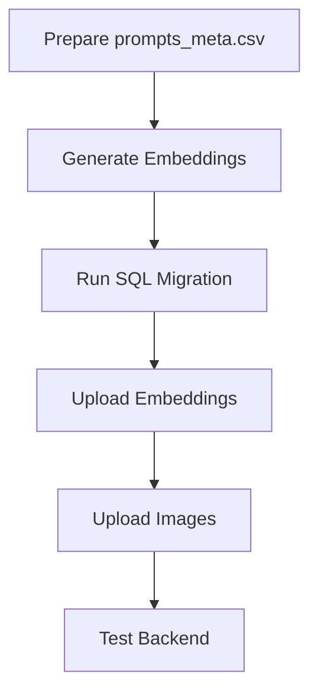

# Scripts Directory

This directory contains utility scripts for the Dishplay backend.

## Semantic Search Scripts

### 1. `setup_semantic_search.bat` (Windows) / `setup_semantic_search.sh` (Linux/Mac)

Interactive setup wizard for semantic search functionality.

**Usage:**
```bash
# Windows
scripts\setup_semantic_search.bat

# Linux/Mac
chmod +x scripts/setup_semantic_search.sh
./scripts/setup_semantic_search.sh
```

**What it does:**
- Checks Python version and dependencies
- Verifies Supabase configuration
- Guides you through SQL migration
- Helps generate and upload embeddings
- Provides checklist for image upload

### 2. `upload_embeddings_from_prompts_meta.py`

Uploads embeddings from Clean-dish-list to Supabase pgvector table.

**Usage:**
```bash
python scripts/upload_embeddings_from_prompts_meta.py \
    --csv-path /path/to/prompts_meta.csv \
    --embeddings-dir /path/to/embeddings
```

**Arguments:**
- `--csv-path`: Path to prompts_meta.csv file (required)
- `--embeddings-dir`: Path to embeddings directory (default: ../Clean-dish-list/embeddings)

**Example:**
```bash
# Windows
python scripts\upload_embeddings_from_prompts_meta.py ^
    --csv-path F:\Programming\Clean-dish-list\prompts_meta.csv ^
    --embeddings-dir F:\Programming\Clean-dish-list\embeddings

# Linux/Mac
python scripts/upload_embeddings_from_prompts_meta.py \
    --csv-path ../Clean-dish-list/prompts_meta.csv \
    --embeddings-dir ../Clean-dish-list/embeddings
```

**What it does:**
1. Loads prompts_meta.csv with columns: name_opt, title, description, type
2. Loads embeddings from recipes.bge-m3.parquet
3. Matches embeddings with metadata by title
4. Uploads to Supabase dish_embeddings table in batches
5. Reports success/failure for each batch

**Requirements:**
- Supabase credentials in .env
- embeddings/recipes.bge-m3.parquet file (generated by Clean-dish-list/embed_prompts_meta.py)
- prompts_meta.csv file

### 3. `upload_embeddings_to_supabase.py` (Alternative)

Original upload script that uses recipes.cleaned.menu.csv instead of prompts_meta.csv.

Use this if your embeddings were generated from a different CSV structure.

## Prerequisites

All scripts require:
- Python 3.9+
- Dependencies from requirements.txt installed
- Supabase project with pgvector extension enabled
- .env file with Supabase credentials

## Workflow

The typical workflow for setting up semantic search:



1. **Prepare prompts_meta.csv**
   - Create CSV with columns: name_opt, title, description, type
   - Example row: `970-0001-miso-butter-roast-chicken,Miso-Butter Roast Chicken,...,food`

2. **Generate Embeddings**
   ```bash
   cd ../Clean-dish-list
   python embed_prompts_meta.py
   ```

3. **Run SQL Migration**
   - Copy supabase/migrations/semantic_search_setup.sql
   - Paste in Supabase SQL Editor
   - Execute

4. **Upload Embeddings**
   ```bash
   cd ../dishplay-backend
   python scripts/upload_embeddings_from_prompts_meta.py \
       --csv-path ../Clean-dish-list/prompts_meta.csv \
       --embeddings-dir ../Clean-dish-list/embeddings
   ```

5. **Upload Images**
   - Upload to Supabase storage bucket: dishes-photos
   - Filename format: {name_opt}.jpg

6. **Test Backend**
   ```bash
   uvicorn main:app --reload
   ```

## Troubleshooting

### "CSV file not found"
- Check the path to prompts_meta.csv
- Use absolute paths if relative paths don't work

### "Embeddings parquet file not found"
- Run embed_prompts_meta.py first in Clean-dish-list
- Check that embeddings/recipes.bge-m3.parquet exists

### "Could not match any records"
- Embeddings were generated from a different CSV
- Regenerate embeddings using prompts_meta.csv
- Ensure title column matches between CSV and embeddings

### "Supabase connection error"
- Check .env file has correct credentials
- Verify SUPABASE_URL and SUPABASE_ANON_KEY

### "Upload batch failed"
- Check Supabase logs for specific errors
- Verify pgvector extension is enabled
- Ensure dish_embeddings table exists

## Environment Variables

Required in `.env`:

```env
SUPABASE_URL=https://your-project.supabase.co
SUPABASE_ANON_KEY=your-anon-key
SUPABASE_SERVICE_ROLE_KEY=your-service-role-key  # Optional, for admin operations
```

## Support

For more information, see:
- [SEMANTIC_SEARCH_SETUP.md](../SEMANTIC_SEARCH_SETUP.md) - Full setup guide
- [IMPLEMENTATION_SUMMARY.md](../IMPLEMENTATION_SUMMARY.md) - Implementation details
